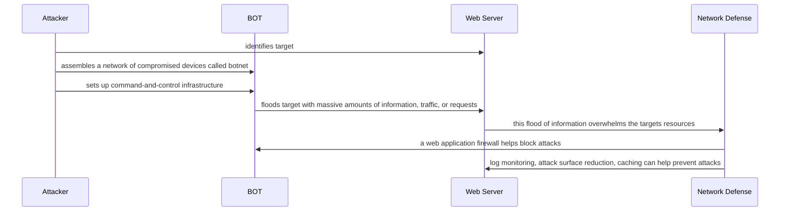

# Documentation
- The attacker identifies the target whether it is high profile or low profile. Example: there was a DDoS attack of GitHub in 2018
  - Attackers may launch DDoS attacks for reasons such as financial gain, political or ideological reasons, demonstrating technical ability, among many others
- An attacker creates network of compromised devices (computers, servers, smartphones, etc) that are infected with malware. This network is called a botnet and under the attackers control, these bots, will be used to launch an attack on target.
- The command-and-control infrastructure allows the attacker to communicate with the compromised devices in the botnet
- The attacker then initiates the attack. DDoS attacks are categorized in to to types of attacks depending on things like the type of traffic used, the method, duration, and target. 
  - The 3 common DDoS attacks are: Volumetric (used above), Protocol, and Application-Layer
- The Web Server or "target" usually has measures in place to prevent attacks such as these
  - prevention methods: attack surface reduction, anycast network diffusion, real-time adaptive threat monitoring, caching, and rate limiting
  - prevention tools: web application firewall and always on DDoS mitigation 
