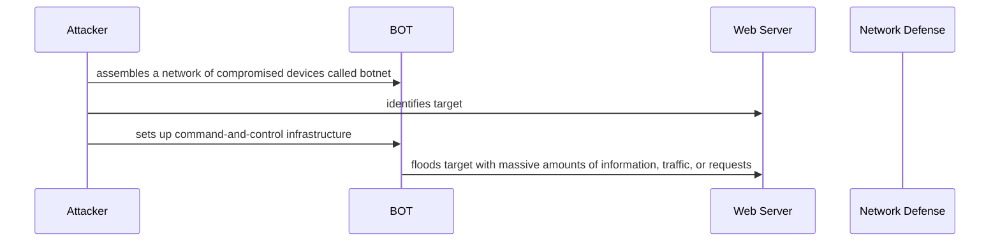

```mermaid
sequenceDiagram
	participant Attacker
	participant BOT
	participant Web Server
	participant Network Defense
	Attacker->>BOT: assembles a network of compromised devices called botnet
	Attacker->>Web Server: identifies target
	Attacker->>BOT: sets up command-and-control infrastructure
	BOT->>Web Server: floods target with massive amounts of information, traffic, or requests
```
