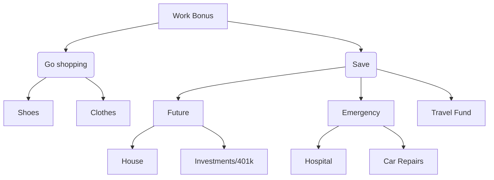

# Description
I created a flow chart to help me make a decision - what I should do with my yearly work bonus. This is kind of like a pros and cons, a list laid out in front of me. I started at the top with the work bonus, that split into what I deem the two things I can do with the money. I can either save the money, or I can spend. I split it further to help me mack a decision by listing the things Iw would spend my money on and why I would save. The in that list, future and emergencies were then broken down to further help make this decision.