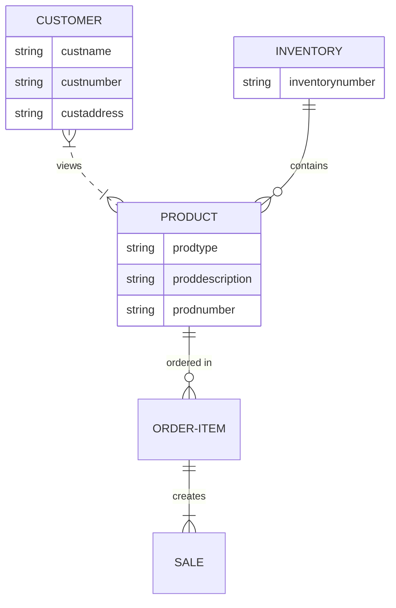

# Brief Description
- Your inventory holds the products that are available for purchase
- Customers purchase these available products creating sales
- Sales create records of what products have and haven't been purchased in a certain period (i.e. month, quarter or year)
- These records allow the company to predict what their inventory should look like. For example, whether Nike should stock more of one shoe and less of another